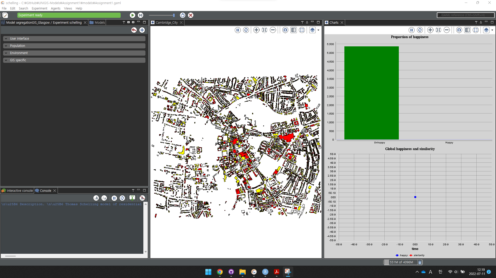
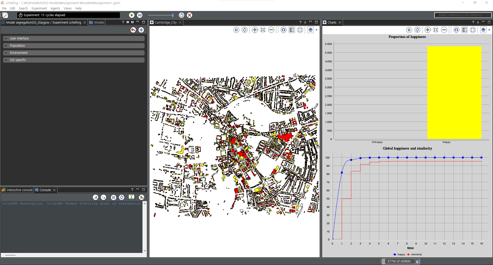

```{r setup, include=FALSE}
knitr::opts_chunk$set(echo = TRUE)
library(tidyverse)
```

## The Agent-based Simulation of Urban Segregation in Cambridge

Inequality has long been issued in our modern cities as the distribution of wealth within the city is unequal ([link](https://urban.jrc.ec.europa.eu/thefutureofcities/social-segregation#the-chapter)). The income, education, as well as ethnicity are a few of the the determinants that generates the imbalance in the society. This widening gap between the rich and the poor triggers the area where people want to dwell.

For example, Cambridge UK has changed significantly since 2010 by its economic wealth, new buildings invested near the Cavendish lab in the West to the immense Biomedical Campus in the south, and the urban sprawl of new towns that attract more people to enjoy the gist of the academic rigour and educational motivation. While Cambridge is known as one of the the safest and most liveable cities in the UK, there also exist deprived areas such as King's Hedges, North Chesterton, and Barnwell which are closer to each other.

The aim of this short piece is to investigate to experiment how heterogeneous agents start with no background who their neighbours are but continuously relocate their locations until they find a perfect match. It is envisaged that urban segregation is not happened from the city creation, rather happened over time.

## Data Import and Setting Up an ABM

### Query to Retrieve the map of Cambridge

The initial job is to visit the openstreepmap website to download the study area. This article visited <https://overpass-turbo.eu/> and typed the code accordingly.

``` javascript
[out:json][timeout:50];(
way["building"]({{bbox}});
relation["building"]["type"="multipolygon"]({{bbox}});
);out;>;out qt;
```

The `geojson` file was opened in QGIS and then exported as a `cambridge.shp` file.

### Opening GIS GAMA

In the segregation model, there are two types of buildings coloured red and yellow. The idea of segregation is that the agents (here buildings) will self-segregate over time into clusters until the happpiness reaches 100%.

The figure below is a snapshot of the GAMA interface waiting to get started. In the interface tab (middle), The chart on the top right shows the proportion of happiness which is a dichotomous in unhappy and happy state. The bottom right chart is a line graph that shows the happiness and similarity over time.

## {width="480"}

## Results

From the figure below, you would see that the happiness reaches 100% after the fourth cycle. This means that each agent (building) has at least 50% of their surroundings with the same colour. The similarity did not reach 100% as their are voids (parks) which exceeded the agents' range of mobility.

{width="480"}
